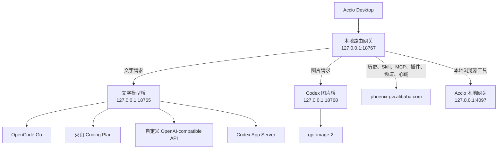

<div align="center">

# Accio Model API Auth

给 Accio Desktop 增加可切换的模型认证与本地路由

[](https://www.microsoft.com/windows)
[](#验证记录)
[](https://nodejs.org/)
[](#安全说明)
[](https://github.com/roctree/accio-model-api-auth/actions/workflows/checks.yml)

在 Accio 里使用 OpenCode Go、火山引擎 Coding Plan、自定义 OpenAI-compatible API 或本机 Codex ChatGPT 登录。图片请求还能独立走 ChatGPT 订阅中的 `gpt-image-2`。

[功能一览](#功能一览) · [快速开始](#快速开始) · [接入方式](#接入方式) · [图片生成](#图片生成) · [运行结构](#运行结构) · [安全说明](#安全说明)

</div>

> [!WARNING]
> 这是非官方社区项目，与 Accio、阿里巴巴、OpenCode、火山引擎或 OpenAI 没有隶属关系。Accio 更新后，内部接口可能变化。使用前请保留可恢复的 Git 版本。

## 功能一览

| 功能 | 当前行为 |
| --- | --- |
| 文字模型 | 支持 OpenCode Go、火山 Coding Plan、自定义 OpenAI-compatible API 和 Codex ChatGPT 登录 |
| 图片模型 | 可独立启用 Codex `gpt-image-2`，文字模型不受影响 |
| 思考模式 | 按服务商和模型显示对应档位，Codex 档位从本机 App Server 动态读取 |
| 套餐状态 | 原配置窗口内显示火山或 Codex 的当前额度、重置时间、模型数量和刷新状态 |
| Accio 工具 | 保留历史会话、Skill、MCP、插件、浏览器、频道和心跳能力 |
| 模型显示 | 在 Accio 模型位置显示实际服务商、模型和思考模式 |
| 配置切换 | 每个服务商分别保存模型、地址、思考模式和凭据 |
| 官方恢复 | 可随时切回 Accio 官方原生认证与官方积分 |
| 本地管理 | 提供可视化配置、常驻托盘、桌面快捷方式和登录启动项 |

## 适合怎样使用

| 需求 | 推荐配置 |
| --- | --- |
| 火山 Coding Plan 负责文字，ChatGPT 负责图片 | 选择火山 Coding Plan，再勾选 Codex 图片通道 |
| OpenCode Go 负责文字，ChatGPT 负责图片 | 选择 OpenCode Go，再勾选 Codex 图片通道 |
| 文字和图片都使用 ChatGPT 订阅 | 选择 Codex ChatGPT 登录，再勾选 Codex 图片通道 |
| 完全恢复 Accio 官方模型和积分 | 选择 Accio 官方原生认证 |

> [!IMPORTANT]
> Accio 官方原生认证会绕过本地路由。Codex 图片通道只在 OpenAI-compatible API 或 Codex ChatGPT 登录模式下生效。

## 快速开始

### 运行条件

- Windows
- Accio Desktop
- 安装在标准路径下的 Node.js
- 使用 Codex 时，还需安装 Codex Desktop，或具备 `codex-code-mode-host.exe` 的完整 Codex 安装
- 自动查询火山套餐和模型时，还需安装官方 Ark CLI：`npm install -g @volcengine/ark-cli@latest`

当前代码已在 Accio Desktop `0.30.2` 上验证。其他版本可能需要重新确认内部接口。

### 第一步打开配置

双击 [`open_config_ui.cmd`](./open_config_ui.cmd)，也可以在 PowerShell 中运行下面的命令。

```powershell
powershell -NoProfile -File .\accio_config_ui.ps1
```

> [!NOTE]
> 启动脚本尊重当前 Windows PowerShell 执行策略，不再使用 `ExecutionPolicy Bypass`，也不会自动修改系统策略。若提示“禁止运行脚本”或“未进行数字签名”，先在 Windows PowerShell 中运行 `Get-ExecutionPolicy -List` 查看原因。`Restricted` 会阻止脚本，`AllSigned` 要求签名；`RemoteSigned` 下的网络下载文件也可能被阻止。只在核实来源并审阅代码后，按 [Microsoft 执行策略说明](https://learn.microsoft.com/en-us/powershell/module/microsoft.powershell.core/about/about_execution_policies?view=powershell-5.1) 处理对应文件；受单位策略管理的电脑请联系管理员，不要关闭杀毒软件或添加全盘排除。

### 第二步选择认证方式

1. 选择 OpenAI-compatible API、Codex ChatGPT 登录或 Accio 官方原生认证。
2. 使用 API 时，再选择 OpenCode Go、火山 Coding Plan 或自定义服务。
3. 选择火山或 Codex 后，顶部状态框会自动查询套餐用量和可用模型。
4. 按需要选择文字模型和思考模式。
5. 需要图片能力时，勾选 Codex `gpt-image-2` 图片通道。

### 第三步保存并重启

点击“保存并重启 Accio”。首次启用真实模型显示时必须重启一次，此后模型名称每 5 秒从本地状态刷新。

图片通道成功启用后，配置界面会显示 `gpt-image-2 可用`。托盘当前模式也会显示 `生图 Codex gpt-image-2`。

### 套餐与模型状态框

状态框就在原配置窗口内，不会打开独立窗口。选择对应认证方式后会立即查询，并每 5 分钟自动刷新；也可以点击状态框里的“刷新”。Ark CLI 与 Codex 查询都在后台运行，不会阻塞模型切换、填写配置或窗口拖动。

| 当前选择 | 状态框显示 | 模型名称下拉框 |
| --- | --- | --- |
| 火山 Coding Plan | 套餐档位、各周期已用比例、模型数量和刷新时间 | 从当前账号持有的 Coding Plan 实时读取 |
| Codex ChatGPT 登录 | 订阅类型、额度窗口、重置时间、Token 统计、模型数量和图片能力 | 从本机 Codex App Server 实时读取 |
| 其他认证方式 | 提示选择火山或 Codex 后查询 | 保持各服务商原有配置 |

火山账号登录与推理 API Key 是两套独立认证。火山状态查询使用官方 Ark CLI 的 SSO 登录；模型请求仍使用单独保存在 Windows 凭据管理器中的 Coding Plan API Key。

Coding Plan 当前返回套餐周期的总用量，不提供按模型拆分的消耗；界面会分别显示套餐总额度和可用模型列表，不会把两者错误关联。

Codex 用量接口与模型接口分别处理。OpenAI 用量服务临时不可用或账号未返回 Token 统计时，界面会显示“部分用量暂不可读”，但登录状态、模型列表和 Accio 调用不会因此失效。

## 接入方式

### OpenCode Go

- 默认模型为 `deepseek-v4-flash`
- 接口使用 OpenAI-compatible `chat/completions`
- 思考模式支持关闭、低、高和最高
- API Key 独立保存在 Windows 凭据管理器

关闭思考时发送 `thinking.type=disabled`。启用思考时发送 `thinking.type=enabled`，并按选择发送 `reasoning_effort=low|high|max`。

### 火山引擎 Coding Plan

- 固定使用 Coding Plan 套餐专用地址
- 模型下拉框通过官方 Ark CLI 自动读取当前套餐可用模型，也允许手动填写
- 套餐额度和模型列表每 5 分钟自动刷新
- 每个模型只显示已经确认的思考档位
- API Key 与 OpenCode Go、自定义 API 分开保存

```text
https://ark.cn-beijing.volces.com/api/coding/v3/chat/completions
```

> [!CAUTION]
> 不要把地址改成普通方舟 `/api/v3`。普通地址不会消耗 Coding Plan 套餐额度，并可能产生额外 API 费用。

<details>
<summary><strong>查看火山模型思考档位</strong></summary>

| 模型 | 可选档位 |
| --- | --- |
| DeepSeek V4 Flash | 低、高、最高 |
| DeepSeek V4 Pro | 高、最高 |
| Doubao Seed 2.0 Lite | 低、中、高 |
| GLM 5.2、GLM 5.3、MiniMax M3 | 按模型能力显示 |
| 未确认模型、`ark-code-latest` | 跟随模型默认 |

选择具体档位时发送 `thinking.type=enabled` 和对应的 `reasoning_effort`。选择单纯开关时只发送 `thinking.type`。工具续轮会保留模型上一轮返回的 `reasoning_content`。

</details>

接口资料可查看 [Coding Plan 套餐与支持模型](https://docs.volcengine.com/docs/82379/1925114?lang=zh) 和 [Coding Plan 常见问题](https://docs.volcengine.com/docs/82379/2165245?lang=zh)。

### 自定义 OpenAI-compatible API

- 可填写完整的 HTTP 或 HTTPS 地址
- 可手动填写模型名称
- 可关闭 API Key 认证
- 可连接本机 Ollama、vLLM 等兼容服务

服务端需要兼容当前桥使用的 `chat/completions` 请求、流式响应和工具调用格式。不同兼容服务对 `thinking` 与 `reasoning_effort` 的支持程度可能不同。

### Codex ChatGPT 登录

- 登录由本机 Codex 托管
- 项目不读取或导出 OAuth Token
- 模型列表从 Codex App Server 动态获取
- 额度窗口、已用百分比、重置时间和 Token 统计从 Codex App Server 动态获取
- 思考模式按模型实际能力显示
- 已验证文字、多轮对话和 Accio 动态工具续轮

在状态框中点击“登录”，完成授权后点击“刷新”。可用思考档位可能包含 `low`、`medium`、`high`、`xhigh`、`max` 和 `ultra`。额度读取使用 `account/rateLimits/read`，Token 统计使用 `account/usage/read`；服务端未返回的字段不会被估算或补造。

### Accio 官方原生认证

- 不经过本地文字桥、图片桥或路由网关
- 模型、认证和积分全部交回 Accio 官方逻辑
- 原有 OpenCode、火山、自定义 API 和 Codex 配置会继续保留
- 切回自定义模式时不需要重新填写已保存的 Key

## 图片生成

勾选“图片生成使用 Codex 订阅”以后，Accio 的图片生成与带参考图编辑请求会单独进入 `127.0.0.1:18768`。文字请求继续使用当前选择的服务商。

图片路由按请求里的 `generationConfig.responseModalities` 判断。数组中包含 `IMAGE` 时进入 Codex 图片桥，其余模型请求继续进入文字桥。下划线格式 `response_modalities` 也能识别。

| 项目 | 行为 |
| --- | --- |
| 图片模型 | 固定显示为 `gpt-image-2` |
| 认证 | 使用本机 Codex 已登录的 ChatGPT 账号 |
| OpenAI API Key | 不需要 |
| 用量 | 计入当前账号的 Codex 使用额度 |
| 参考图 | 转成 Codex 图片输入并随请求提交 |
| 返回格式 | 转成 Accio 可读取的 `inlineData` |
| 图片通道关闭 | 图片请求返回明确的 `ACCIO_IMAGE_PROVIDER_DISABLED` 错误 |

本项目没有接入火山 Agent Plan。没有 Agent Plan 时，可以继续使用火山 Coding Plan 处理文字，同时让 Codex 订阅处理图片。

Codex 图片能力说明可查看 [Image generation](https://learn.chatgpt.com/docs/image-generation)。

## 运行结构



### Codex 工具续轮

Accio 的工具声明会映射为 Codex 动态工具。Codex 发出工具请求后，本地桥把 `functionCall` 返回给 Accio。Accio 执行 Skill、MCP、插件或浏览器工具，再提交 `functionResponse`，本地桥随后续接原 Codex turn。

Codex 内置 shell、文件、Web、MCP 和子智能体工具不会桥接给 Accio。协议与认证资料可查看 [Codex App Server](https://learn.chatgpt.com/docs/app-server) 和 [Codex authentication](https://learn.chatgpt.com/docs/auth)。

## 托盘与快捷方式

双击 [`install_tray.cmd`](./install_tray.cmd) 安装当前用户的常驻托盘。

安装后会创建下面这些入口。

- 桌面快捷方式“Accio 模型认证配置”
- 开始菜单快捷方式“Accio 模型认证配置”
- Windows 登录启动项“Accio 模型认证托盘”

托盘使用 Accio 自带图标。双击图标可以打开配置。右键菜单可以查看当前认证方式、应用配置并重启 Accio、启动 Accio 或退出托盘。托盘保持单实例，退出托盘不会关闭 Accio。

## 命令行

保存当前 API 服务商的 Key。

```powershell
powershell -NoProfile -File .\accio_opencode_launcher.ps1 -StoreCredential
```

启动本地服务与 Accio。

```powershell
powershell -NoProfile -File .\accio_opencode_launcher.ps1
```

只启动本地文字桥、图片桥和路由网关。

```powershell
powershell -NoProfile -File .\accio_opencode_launcher.ps1 -BackendOnly
```

强制重启本地桥接服务。

```powershell
powershell -NoProfile -File .\accio_opencode_launcher.ps1 -BackendOnly -RestartBridge
```

## 配置与凭据

非敏感配置保存在下面的文件中。

```text
%LOCALAPPDATA%\AccioModelApiAuth\config.json
```

敏感凭据分别保存在 Windows 凭据管理器。

| 凭据 | 保存方式 |
| --- | --- |
| OpenCode Go API Key | 独立凭据项 |
| 火山 Coding Plan API Key | 独立凭据项 |
| 自定义 API Key | 独立凭据项 |
| Accio 本地网关口令 | 首次启动随机生成并单独保存 |
| Codex OAuth | 完全交给 Codex 自己保存和刷新 |

## 验证记录

### 自动化检查

每次 PR 更新，以及 `main`、`feat/**`、`feature/**` 分支推送，都会触发 [Windows checks](https://github.com/roctree/accio-model-api-auth/actions/workflows/checks.yml)。测试不启动 Accio，不读取真实登录凭据，也不调用收费模型。

| 检查 | 覆盖内容 |
| --- | --- |
| PowerShell 语法 | 仓库内所有 `.ps1` 文件的 AST 解析 |
| JavaScript 语法 | 已跟踪 `.js` / `.cjs` 文件的 `node --check` |
| 配置回归测试 | 火山新旧模型字段、个人与团队套餐、空数据、失败隔离、零额度、模型与思考档位保留 |
| Codex 状态回归测试 | 模拟 JSON-RPC、多组与旧版额度、空值、用量服务失败、未登录、进程清理 |
| 差异检查 | 提交中的空白字符错误 |

本地复现（Windows PowerShell 5.1 与 Node.js 24）：

```powershell
powershell -NoProfile -File .\tests\config-ui.tests.ps1
node --test .\tests\codex-status.test.cjs
```

测试数据是人工构造的离线样例。CI 通过不等于真实套餐、所有 Accio 版本或杀毒软件均验证通过。工作流只使用仓库读取权限，不传入业务密钥，依赖的官方 Actions 固定到提交 SHA。

### 历史本机验证

| 项目 | 验证结果 |
| --- | --- |
| Accio Desktop `0.30.2` | Windows 本机通过 |
| 历史会话读取 | 通过 Accio 原网关恢复 |
| Skill、MCP、插件 | 原网关转发链已恢复 |
| 浏览器工具 | 调用和结果回传通过 |
| OpenCode Go | 文字和工具调用链已接通 |
| 火山 Coding Plan | 请求格式、流式响应和工具续轮通过本地模拟接口验证 |
| Codex 文字 | 登录、模型列表、多轮对话和动态工具续轮通过 |
| Codex 图片 | ChatGPT Pro 本机真实调用通过，返回 `1254 × 1254` PNG，约 `827 KB` |
| 图片路由 | 驼峰与下划线两种 `responseModalities` 格式均通过 |

火山真实套餐最终能使用哪些模型，取决于账号、API Key 和控制台开放范围。Codex 图片是否可用，取决于当前 ChatGPT 账号返回的图片能力。

## 已知限制

- Accio 更新可能改变内部请求路径、字段或缓存结构
- Codex 上游偶尔可能完成 turn 却没有返回图片，此时桥会给出明确错误
- 图片通道不会自动重试，避免一次操作重复消耗订阅额度
- 图片比例与尺寸会交给 Codex 图片能力处理，最终像素尺寸可能与请求值不同
- Accio 官方原生认证不会使用本项目的 Codex 图片通道
- 火山 Coding Plan 的真实套餐可用性无法只靠本地模拟接口确认

## 安全说明

- 清理高风险启动参数只能减少可疑特征，不能保证不被任何杀毒软件误报；当前脚本没有商业代码签名
- 不要把 API Key、Cookie、登录令牌或运行日志提交到仓库
- 项目不会读取或导出 Codex、ChatGPT 或 Accio 的登录令牌
- 本地服务只监听 `127.0.0.1`
- API Key 不写入源码或 `config.json`
- 公开问题报告前应删除请求头、凭据和个人会话内容

## 主要文件

| 文件 | 用途 |
| --- | --- |
| [`accio_config_ui.ps1`](./accio_config_ui.ps1) | 可视化认证、模型、思考模式和图片通道配置 |
| [`accio_opencode_launcher.ps1`](./accio_opencode_launcher.ps1) | 保存凭据、启动桥接服务和启动 Accio |
| [`accio_opencode_bridge.cjs`](./accio_opencode_bridge.cjs) | OpenAI-compatible 文字模型桥 |
| [`accio_codex_bridge.js`](./accio_codex_bridge.js) | Codex 文字桥与 `gpt-image-2` 图片桥 |
| [`accio_gateway_relay.js`](./accio_gateway_relay.js) | 模型、图片、原网关和本地工具请求分流 |
| [`accio_codex_status.js`](./accio_codex_status.js) | Codex 登录、模型和图片能力读取 |
| [`accio_tray.ps1`](./accio_tray.ps1) | Windows 常驻托盘 |
| [`install_tray.ps1`](./install_tray.ps1) | 托盘、快捷方式和登录启动项安装 |

---

如果 Accio 更新后出现模型、历史会话或工具调用异常，请先切回官方原生认证，再附上已脱敏的本地健康状态与复现步骤提交 Issue。
